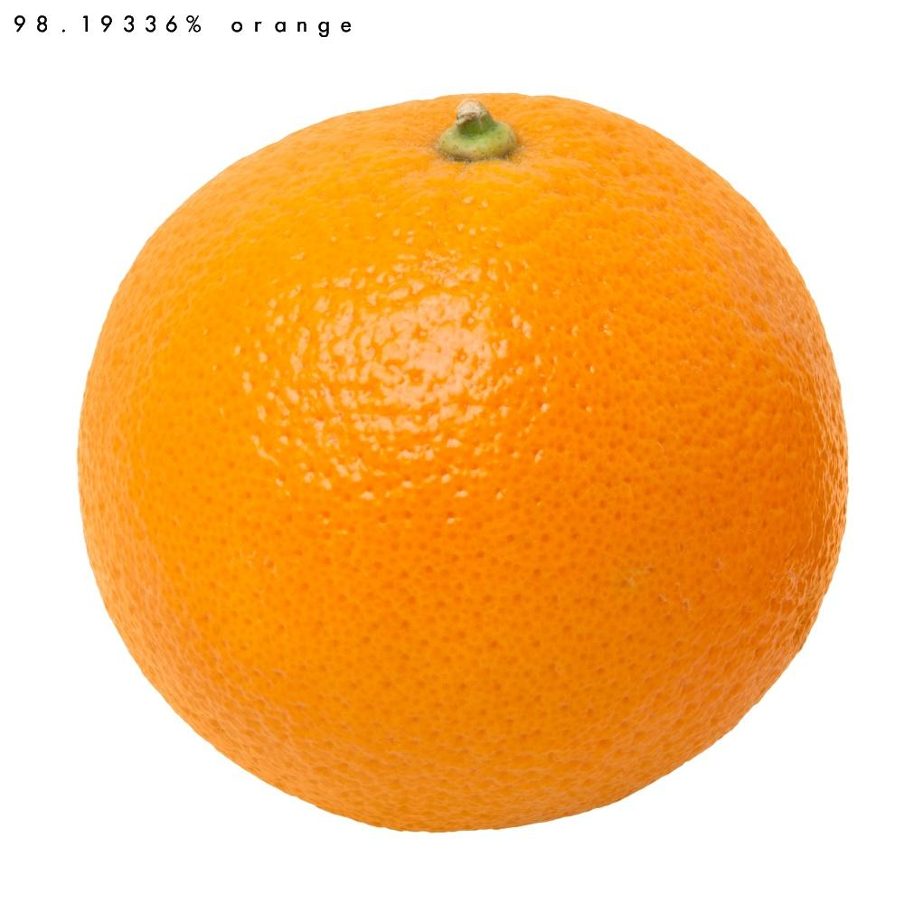
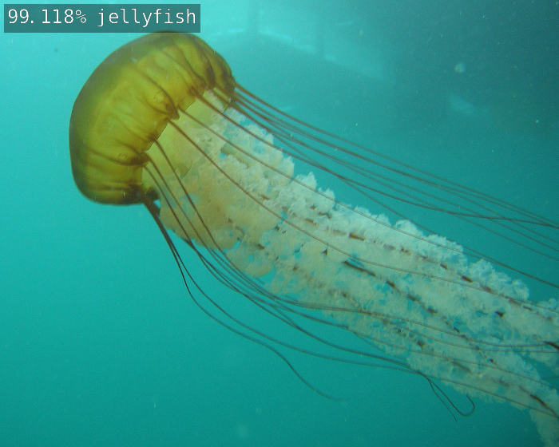
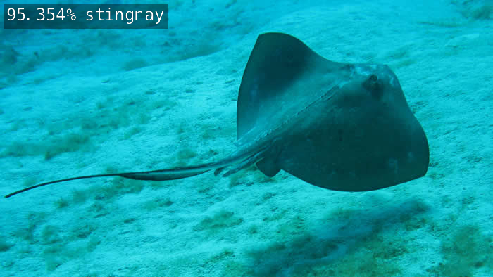

## Jetsonでコンソールプログラムを使用する

最初に、 `imagenet-console`プログラムを使用して、いくつかのサンプル画像でimageNet認識をテストしてみましょう。画像を読み込み、TensorRTと `imageNet`クラスを使用して推論を実行し、分類結果をオーバーレイして出力画像を保存します。リポジトリには、使用するサンプル画像がいくつか付属しています。

まず．ターミナルが `aarch64 / bin`ディレクトリにあることを確認してください：
``` bash
$ cd jetson-inference/build/aarch64/bin
```

次に、プログラムを使用して、C++またはPythonを使用して、サンプル画像を分類しましょう。 

`imagenet-console`は3つのコマンドライン引数を受け入れます：
- 入力画像へのパス（ `jpg、png、tga、bmp`）
- 出力画像へのオプションのパス（ `jpg、png、tga、bmp`）
- 使用されている分類モデルを変更するオプションの `--network`フラグ（デフォルトのネットワークはGoogleNetです）。


C++
```bash
$ ./imagenet-console --network=googlenet images/orange_0.jpg output_0.jpg  # --network flag is optional
```

Python
```bash
$ ./imagenet-console.py --network=googlenet images/orange_0.jpg output_0.jpg  # --network flag is optional
```

最初に起動する際は，時間がかかります．



C++
```bash
$ ./imagenet-console  images/granny_smith_1.jpg output_0.jpg 
```

Python
```bash
$ ./imagenet-console.py images/granny_smith_1.jpg output_0.jpg 
```

## 他の分類用モデルのダウンロードは以下の表が可能です．


| Network       | CLI argument   | NetworkType enum |
| --------------|----------------|------------------|
| AlexNet       | `alexnet`      | `ALEXNET`        |
| GoogleNet     | `googlenet`    | `GOOGLENET`      |
| GoogleNet-12  | `googlenet-12` | `GOOGLENET_12`   |
| ResNet-18     | `resnet-18`    | `RESNET_18`      |
| ResNet-50     | `resnet-50`    | `RESNET_50`      |
| ResNet-101    | `resnet-101`   | `RESNET_101`     |
| ResNet-152    | `resnet-152`   | `RESNET_152`     |
| VGG-16        | `vgg-16`       | `VGG-16`         |
| VGG-19        | `vgg-19`       | `VGG-19`         |
| Inception-v4  | `inception-v4` | `INCEPTION_V4`   |


> **note**:  ダウンロードして使うためには以下のコマンドを動かしてください．<br/>
> &nbsp;&nbsp;&nbsp;&nbsp;&nbsp;&nbsp;&nbsp;&nbsp;&nbsp;&nbsp;&nbsp;&nbsp;&nbsp;`$ cd jetson-inference/tools` <br/>
> &nbsp;&nbsp;&nbsp;&nbsp;&nbsp;&nbsp;&nbsp;&nbsp;&nbsp;&nbsp;&nbsp;&nbsp;&nbsp;`$ ./download-models.sh` <br/>

## 異なる分類モデルを使ってみます．

コマンドラインで--networkフラグを上記の表の対応するコマンドラインの引数の1つに設定することにより、ロードするモデルを指定できます。デフォルトでは、オプションの--networkフラグが指定されていない場合、GoogleNetがロードされます。

以下は、ResNet-18モデルの使用例です。

C++
```bash
$ ./imagenet-console --network=resnet-18 images/jellyfish.jpg output_jellyfish.jpg
```
Python
```bash
$ ./imagenet-console.py --network=resnet-18 images/jellyfish.jpg output_jellyfish.jpg
```


C++
```bash
$ ./imagenet-console --network=resnet-18 images/stingray.jpg output_stingray.jpg
```
Python
```bash
$ ./imagenet-console.py --network=resnet-18 images/stingray.jpg output_stingray.jpg
```


C++
```bash
$ ./imagenet-console.py --network=resnet-18 images/coral.jpg output_coral.jpg
```
Python
```bash
$ ./imagenet-console.py --network=resnet-18 images/coral.jpg output_coral.jpg
```
さまざまなモデルを使用して自由に実験し、それらの精度とパフォーマンスがどのように異なるかを確認してください。

次に、独自の画像認識プログラムをゼロからコーディングする手順を実行します。