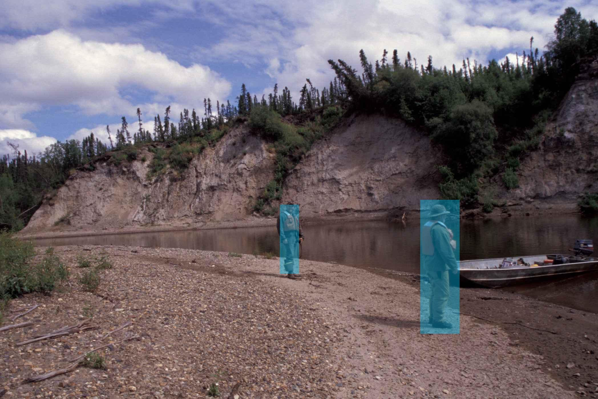
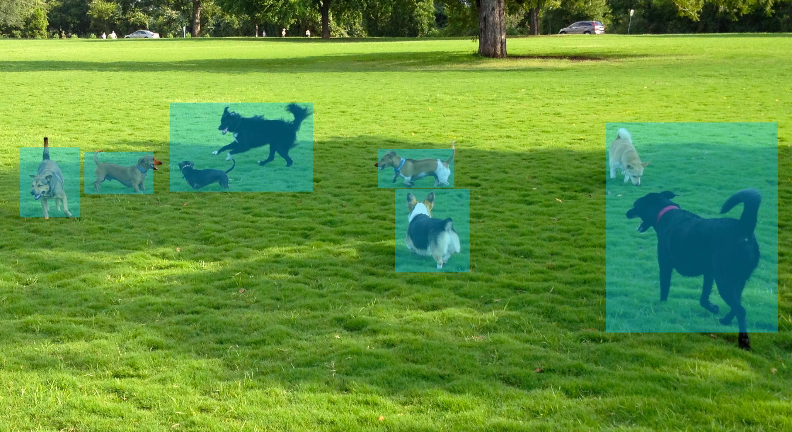

## 次は検出のプログラムを試しましょう．

既に準備されている学習済みモデルを用いた物体検出のプログラムを試してみましょう．
このサンプル(detectnet-console)では，'SSD-Mobilenet-V2'を使っています．
```bash
# C++
$ ./detectnet-console --network=pednet images/peds_4.jpg output.jpg

# Python
$ ./detectnet-console.py --network=pednet images/peds_4.jpg output.jpg
```



### Pre-trained Detection Models Available

以下は、ダウンロードで利用可能な事前トレーニング済みオブジェクト検出ネットワークの表と、事前検出の読み込みに使用される `detectnet-console`に関連付けられた` --network`引数です。


| Model                   | CLI argument       | NetworkType enum   | Object classes       |
| ------------------------|--------------------|--------------------|----------------------|
| SSD-Mobilenet-v1        | `ssd-mobilenet-v1` | `SSD_MOBILENET_V1` | 91 ([COCO classes](https://raw.githubusercontent.com/AastaNV/TRT_object_detection/master/coco.py))     |
| SSD-Mobilenet-v2        | `ssd-mobilenet-v2` | `SSD_MOBILENET_V2` | 91 ([COCO classes](https://raw.githubusercontent.com/AastaNV/TRT_object_detection/master/coco.py))     |
| SSD-Inception-v2        | `ssd-inception-v2` | `SSD_INCEPTION_V2` | 91 ([COCO classes](https://raw.githubusercontent.com/AastaNV/TRT_object_detection/master/coco.py))     |
| DetectNet-COCO-Dog      | `coco-dog`         | `COCO_DOG`         | dogs                 |
| DetectNet-COCO-Bottle   | `coco-bottle`      | `COCO_BOTTLE`      | bottles              |
| DetectNet-COCO-Chair    | `coco-chair`       | `COCO_CHAIR`       | chairs               |
| DetectNet-COCO-Airplane | `coco-airplane`    | `COCO_AIRPLANE`    | airplanes            |
| ped-100                 | `pednet`           | `PEDNET`           | pedestrians          |
| multiped-500            | `multiped`         | `PEDNET_MULTI`     | pedestrians, luggage |
| facenet-120             | `facenet`          | `FACENET`          | faces                |

> **note**:  ダウンロードは以下のコマンドをつかましょう<br/>
> &nbsp;&nbsp;&nbsp;&nbsp;&nbsp;&nbsp;&nbsp;&nbsp;&nbsp;&nbsp;&nbsp;&nbsp;&nbsp;`$ cd jetson-inference/tools` <br/>
> &nbsp;&nbsp;&nbsp;&nbsp;&nbsp;&nbsp;&nbsp;&nbsp;&nbsp;&nbsp;&nbsp;&nbsp;&nbsp;`$ ./download-models.sh` <br/>

## 違うモデルでは以下のようになります．
コマンドラインにて，--network　オプションを用いることで，異なる学習済みのトレーニングデータを活用することができます．ここでは，COCOモデルを用いてみます．

```bash
# C++
$ ./detectnet-console --network=coco-dog images/dog_3.jpg output_1.jpg

# Python
$ ./detectnet-console.py --network=coco-dog images/dog_3.jpg output_1.jpg
```


