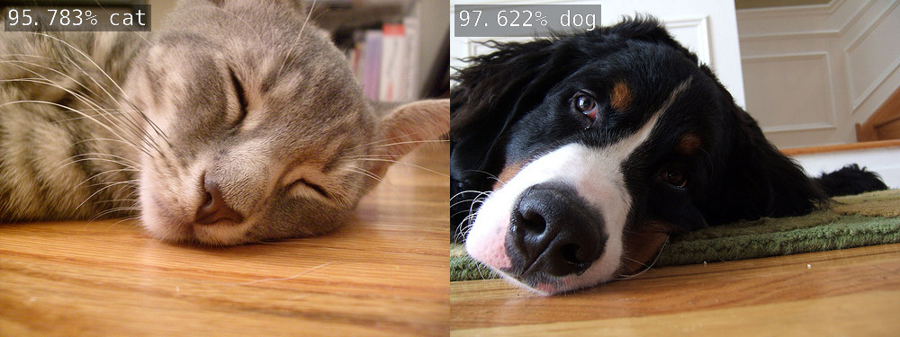
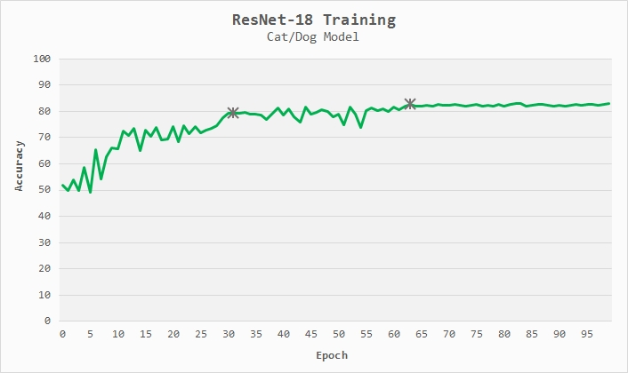
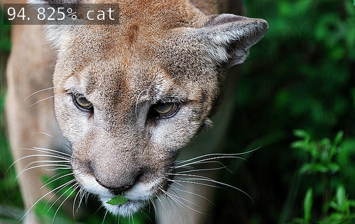
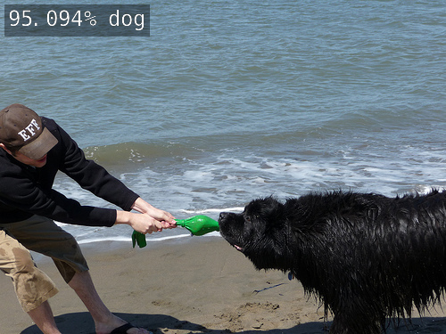
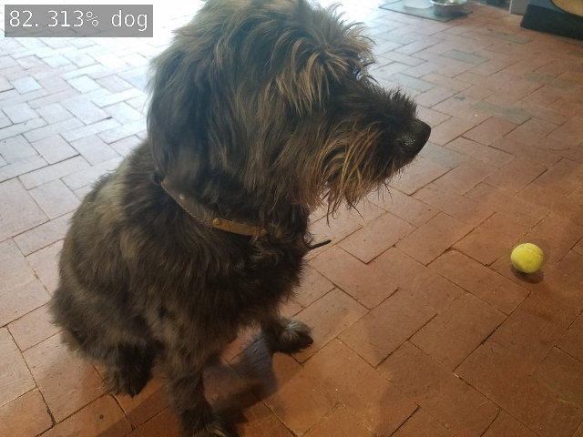

## 拡張編
犬と猫だけを認識するモデルをJetson Nanoで作ってみよう．


 5000のトレーニング画像、1000の検証画像、および200のテスト画像を含む800 MBのデータセットを以下に示します。それぞれは猫と犬のクラスに均等に分割されています。トレーニング画像のセットは転移学習に使用され、検証セットはトレーニング中の分類精度の評価に使用され、テスト画像はトレーニングの完了後に使用されます。ネットワークは検証セットとテストセットで直接トレーニングされることはなく、トレーニングセットのみがトレーニングされます。

 データセットからの画像は、利用可能な猫の画像の量が犬より少し少なかったため、トラやマウンテンライオンなどの大きなネコ科動物を含む、さまざまな種類の犬と猫で構成されています。一部の画像には人間も写っており、検出器は基本的に背景として無視し、猫と犬のコンテンツに焦点を当てるように訓練されています。

始めるには、まずJetsonにPyTorchがインストールされていることを確認してから、以下のデータセットをダウンロードしてトレーニングスクリプトを開始します。その後、いくつかの静的画像とライブカメラフィードでTensorRTで再トレーニングされたモデルをテストします。

- [Pytorchのインストール](https://github.com/dusty-nv/jetson-inference/blob/master/docs/pytorch-transfer-learning.md#installing-pytorch)

### Dataのダウンロード
このチュートリアルでは、```〜/datasets``` などの共通の場所にデータセットを保存します。好きな場所に保存できます。以下の手順で```~/datasets```を希望のパスに置き換えてください：

```
$ mkdir ~/datasets
$ cd ~/datasets
```

次のダウンロードとデータの抽出を行います．

```
$ wget https://nvidia.box.com/shared/static/o577zd8yp3lmxf5zhm38svrbrv45am3y.gz -O cat_dog.tar.gz
$ tar xvzf cat_dog.tar.gz
```

### ResNet-18 Modelの再学習
学習を開始するには，以下のコマンドを入力してください．

```
$ cd jetson-inference/python/training/classification
$ python train.py --model-dir=cat_dog ~/datasets/cat_dog
```

トレーニングが開始されると，次のようなテキストが表示されます．

```
Use GPU: 0 for training
=> dataset classes:  2 ['cat', 'dog']
=> using pre-trained model 'resnet18'
=> reshaped ResNet fully-connected layer with: Linear(in_features=512, out_features=2, bias=True)
Epoch: [0][  0/625]	Time  0.932 ( 0.932)	Data  0.148 ( 0.148)	Loss 6.8126e-01 (6.8126e-01)	Acc@1  50.00 ( 50.00)	Acc@5 100.00 (100.00)
Epoch: [0][ 10/625]	Time  0.085 ( 0.163)	Data  0.000 ( 0.019)	Loss 2.3263e+01 (2.1190e+01)	Acc@1  25.00 ( 55.68)	Acc@5 100.00 (100.00)
Epoch: [0][ 20/625]	Time  0.079 ( 0.126)	Data  0.000 ( 0.013)	Loss 1.5674e+00 (1.8448e+01)	Acc@1  62.50 ( 52.38)	Acc@5 100.00 (100.00)
Epoch: [0][ 30/625]	Time  0.127 ( 0.114)	Data  0.000 ( 0.011)	Loss 1.7583e+00 (1.5975e+01)	Acc@1  25.00 ( 52.02)	Acc@5 100.00 (100.00)
Epoch: [0][ 40/625]	Time  0.118 ( 0.116)	Data  0.000 ( 0.010)	Loss 5.4494e+00 (1.2934e+01)	Acc@1  50.00 ( 50.30)	Acc@5 100.00 (100.00)
Epoch: [0][ 50/625]	Time  0.080 ( 0.111)	Data  0.000 ( 0.010)	Loss 1.8903e+01 (1.1359e+01)	Acc@1  50.00 ( 48.77)	Acc@5 100.00 (100.00)
Epoch: [0][ 60/625]	Time  0.082 ( 0.106)	Data  0.000 ( 0.009)	Loss 1.0540e+01 (1.0473e+01)	Acc@1  25.00 ( 49.39)	Acc@5 100.00 (100.00)
Epoch: [0][ 70/625]	Time  0.080 ( 0.102)	Data  0.000 ( 0.009)	Loss 5.1142e-01 (1.0354e+01)	Acc@1  75.00 ( 49.65)	Acc@5 100.00 (100.00)
Epoch: [0][ 80/625]	Time  0.076 ( 0.100)	Data  0.000 ( 0.009)	Loss 6.7064e-01 (9.2385e+00)	Acc@1  50.00 ( 49.38)	Acc@5 100.00 (100.00)
Epoch: [0][ 90/625]	Time  0.083 ( 0.098)	Data  0.000 ( 0.008)	Loss 7.3421e+00 (8.4755e+00)	Acc@1  37.50 ( 50.00)	Acc@5 100.00 (100.00)
Epoch: [0][100/625]	Time  0.093 ( 0.097)	Data  0.000 ( 0.008)	Loss 7.4379e-01 (7.8715e+00)
```

トレーニングをいつでも停止するには、```Ctrl + C```を押します。また、後で```--resume```および```--epoch-start```フラグを使用してトレーニングを再開できるため、モデルをテストする前にトレーニングが完了するのを待つ必要はありません。

使用できる各オプションの詳細については、```python train.py --help```を実行します。これには、```-archフラグ```で試すことができる他のネットワークも含まれます。

### 学習用パラメータ

トレーニングプロセス中の上記の統計出力は、次の情報に対応しています。

- Epoch：エポックは、データセットに対する1つの完全なトレーニングパスです
   -  Epoch：[N]は、現在エポック0、1、2、ectなどにいることを意味します。
   - デフォルトでは35エポックで実行されます（これは```--epochs = N```フラグで変更できます）
- ```[N / 625]```は、現在のエポックからの現在の画像バッチです
   - トレーニング画像はパフォーマンスを向上させるためにミニバッチで処理されます
   - デフォルトのバッチサイズは8画像で、```-batch = N```フラグで設定できます
   - 括弧内の数値にバッチサイズを掛けます（例：バッチ```[100/625]```->画像```[800/5000]```）
- Time：現在の画像バッチの処理時間（秒）
- Data：現在のイメージバッチのディスク読み込み時間（秒）
- Loss：モデルが作成した累積エラー（予想 対 予測）
- ```Acc @ 1```：バッチ全体でトップ1の分類精度
  - Top-1、モデルが正確に正しいクラスを予測したことを意味します
- ```Acc @ 5```：バッチ全体のトップ5分類精度
  - Top-5、つまり正しいクラスは予測されたモデルの上位5つの出力の1つだったことを意味します
  - この猫/犬の例には2つのクラス（猫と犬）しかないため、Top-5は常に100％です。
  - チュートリアルのその他のデータセットには5つ以上のクラスがあり、Top-5が有効です

トレーニング中にこれらの統計を監視して、モデルがどれだけ適切にトレーニングされているか、継続するか停止してテストするかを判断できます。上記のように、必要に応じて後でトレーニングを再開できます。

### モデルの精度について

この5000個の画像のデータセットでは、ResNet-18のトレーニングには、Jetson Nanoで1エポックごとに約7〜8分かかり、モデルを35エポックおよび80％の分類精度でトレーニングするには約4-5時間(8x35=280分)かかります。以下は、エポックのトレーニングの進行とモデルの精度を分析するためのグラフです。



エポック30前後で、ResNet-18モデルは80％の精度に達し、エポック65で82.5％の精度に収束します。トレーニング時間が長くなると、データセットのサイズを大きくするか、より複雑なモデルを試すことで、精度をさらに向上させることができます。

デフォルトでは、トレーニングスクリプトは35エポックで実行するように設定されていますが、モデルをテストするためにそれほど長く待てない場合は、トレーニングを早期に終了して次のステップに進むことができます（オプションで後でトレーニングを再開することもできます）中断したところから）。また、ここから完全な100エポック用にトレーニングされたこの完成モデルをダウンロードできます。

- [https://nvidia.app.box.com/s/zlvb4y43djygotpjn6azjhwu0r3j0yxc](https://nvidia.app.box.com/s/zlvb4y43djygotpjn6azjhwu0r3j0yxc)

モデルは ```jetson-inference/python/training/classification/cat_dog/```の下に保存されることに注意してください。これには、最新のエポックからのチェックポイントと、最高の分類精度を持つ最高のパフォーマンスモデルが含まれます。 ```--model-dir```フラグを変更することにより、モデルが保存されるディレクトリを変更できます。

### ONNXへモデルをコンバート

テストとリアルタイム推論のためにTensorRTで再トレーニングされたResNet-18モデルを実行するには、まず、TensorRTがロードできるようにPyTorchモデルをONNX形式に変換する必要があります。 ONNXは、PyTorch、TensorFlow、TensorRTなどの一般的なMLフレームワークの多くをサポートするオープンモデル形式であるため、ツール間でモデルを簡単に転送できます。

PyTorchには、PyTorchモデルをONNXにエクスポートするためのサポートが組み込まれているため、次のコマンドを実行して、提供されている```onnx_export.py```スクリプトを使用してCat/Dogモデルを変換します。

```
python onnx_export.py --model-dir=cat_dog
```

これにより、```resson18.onnx```というモデルが ```jetson-inference/python/training/classification/cat_dog/```の下に作成されます。

### TensorRTを用いた 画像認識

いくつかの静的テストイメージを分類するには、```imagenet-console```の拡張コマンドラインパラメーターを使用して、上記で再トレーニングしたカスタマイズされた```ResNet-18```モデルを読み込みます。これらのコマンドを実行するには、ターミナルの作業ディレクトリが引き続き```jetson-inference/python/training/classification/```にある必要があります。

```
DATASET=~/datasets/cat_dog

# C++
imagenet-console --model=cat_dog/resnet18.onnx --input_blob=input_0 --output_blob=output_0 --labels=$DATASET/labels.txt $DATASET/test/cat/01.jpg cat.jpg

# Python
imagenet-console.py --model=cat_dog/resnet18.onnx --input_blob=input_0 --output_blob=output_0 --labels=$DATASET/labels.txt $DATASET/test/cat/01.jpg cat.jpg
```



```
# C++
imagenet-console --model=cat_dog/resnet18.onnx --input_blob=input_0 --output_blob=output_0 --labels=$DATASET/labels.txt $DATASET/test/dog/01.jpg dog.jpg

# Python
imagenet-console.py --model=cat_dog/resnet18.onnx --input_blob=input_0 --output_blob=output_0 --labels=$DATASET/labels.txt $DATASET/test/dog/01.jpg dog.jpg
```


catとdogクラスの間のデータセットには200個のテスト画像が含まれています。または、独自の画像をダウンロードして試すことができます。次に、ライブカメラフィードで再トレーニングしたモデルを実行してみます。

```
DATASET=~/datasets/cat_dog

# C++
imagenet-camera --model=cat_dog/resnet18.onnx --input_blob=input_0 --output_blob=output_0 --labels=$DATASET/labels.txt

# Python
imagenet-camera.py --model=cat_dog/resnet18.onnx --input_blob=input_0 --output_blob=output_0 --labels=$DATASET/labels.txt
```


