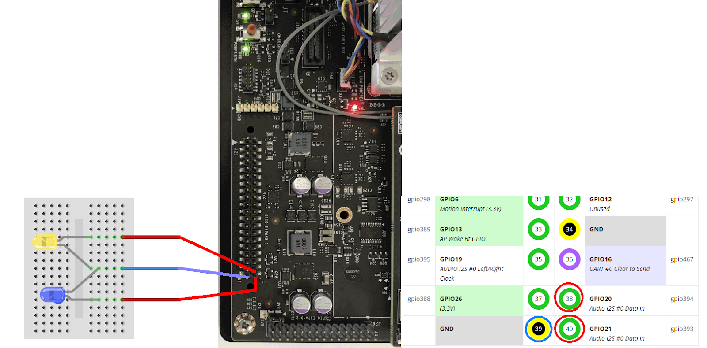
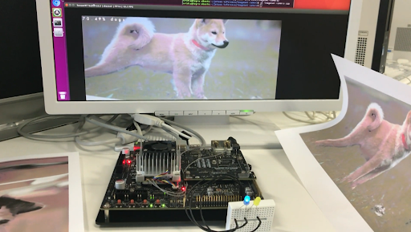

##  学習済みモデルを使った犬・猫画像認識
### プロンプトから以下のコマンドを入力して下さい。

- [トレーニング済みのデータ](pretrain/20190128-065516-bff9_epoch_31.0.tar.gz)

```
$ cd
$ mkdir dogscatsmodel
$ cd dogscatsmodel
$ tar -xzf ~/Downloads/2019～～.tar.gz 		#ダウンロードしたファイル名
$ ls
```

- ※ダウンロードした学習モデルを展開しています
- ※ここで表示される snapshot～～.caffemodelというファイル(学習済みモデル本体)のファイル名を確認しておいて下さい

### プロンプトから以下のコマンドを入力して下さい。
- ※３行目～５行目はまとめて１行です

```
$ cd ~/jetson-inference/build/aarch64/bin

$ export NET=~/dogscatsmodel

$ ./imagenet-camera --prototxt=$NET/deploy.prototxt --model=$NETsnapshot_iter_～～.caffemodel --labels=$NET/labels.txt --input_blob=data --output_blob=softmax
```


- ※「snapshot_iter_～～」は上の手順で確認したファイル名です
- ※ダウンロードした学習モデルを使ってカメラ映像をリアルタイムに推論するようにパラメタ指定しています
- ※初回はニューラルネットワークモデルの最適化が行われるため起動に時間がかかります


## GPIOの制御

- JetsonにはGPIO端子があり、LEDやサーボモータ等の電子回路を簡単に制御できます。このため、「AIで識別した結果に応じて電子回路を制御する」をエッジ側で完結させる、いわゆるエッジコンピューティングを手軽に試すことができます。
- そこで、今回のハンズオンの最後の作業として、カメラ画像の識別結果(犬か猫か)に応じて２つのLEDを点灯させるように先ほどのサンプルプログラムを書き換えます。
- なお、JetsonのGPIO制御は、Raspberry Piなどと同様にファイルシステムの一部として制御できます(特定のファイル(パス)に１を書き込むとGPIOのピンに電気が流れるなど)ので簡単です。
- TX2のGPIOのピン配列の情報は[こちら](https://www.jetsonhacks.com/nvidia-jetson-tx2-j21-header-pinout/)を参照して下さい。今回は右列手前の２ピン(gpio393, gpio394)を使います。

### LEDの接続
- Jetsonをシャットダウンし、下図の通りブレッドボード・ジャンパケーブル・LEDを接続して下さい

 ※↑各LEDの短い方の線を青いジャンパケーブルと同じ列に差し込んで下さい。

###  GPIOのピン有効化と動作確認

- プロンプトから以下のコマンドを入力し、２つのピンをデジタル出力用として有効化します
```
$ sudo su  # password は，qwer1234
```
```
$ cd /sys/class/gpio/
$ echo 393 > export 			# gpio393 を有効化
$ echo 394 > export 			# gpio394 も有効化
$ echo out > gpio393/direction 	# gpio393 を出力モードに設定
$ echo out > gpio394/direction 	# gpio394 も出力モードに設定
$ chmod 666 gpio393/value 		# gpio393 のON/OFFを誰でもできるように変更
$ chmod 666 gpio394/value 		# gpio394 のON/OFFも誰でもできるように変更

$ exit
```

- プロンプトから以下のコマンドを入力し、ＬＥＤの点灯・消灯の動作を確認します

```
$ cd /sys/class/gpio/
$ echo 1 > gpio393/value 		# gpio393 をONにする(青LEDが光るはず)
$ echo 0 > gpio393/value 		# gpio393 をOFFにする(青LEDが消えるはず)
$ echo 1 > gpio394/value 		# gpio394 をONにする(黄LEDが光るはず)
$ echo 0 > gpio394/value 		# gpio394 をOFFにする(黄LEDが消えるはず)
```

- ※うまく光らなかったら回路を見直して下さい

----
- では、推論プログラム(imagenet_camera)を書き換え、推論結果(犬か猫か)に応じて適切なGPIOピンをONにするようにしてみましょう。
- imagenet_cameraのソースコードはC++言語で書かれており、imagenet-camera.cpp というファイル名です。
　このプログラムの中で推論を行っている部分は、140行目付近にある以下の処理です。

```
// classify image
const int img_class = net->Classify(imgRGBA, camera->GetWidth(), camera->GetHeight(), &confidence);
```

- この処理によって実行時に指定した学習済みモデルによってカメラ画像が推論され、結果が img_class変数に代入されます。
- img_classに代入されるのは「dogs」や「cats」といった文字列(ラベル)ではなく、「0」や「1」などの数値です。
- 数値とラベルの対応は、上記で展開したファイルに入っている labels.txt を見れば分かります。

```
cats
dogs
other
```


- このように単純にラベルが並んでいるだけですが、この並びが推論結果の数値に対応しており、推論結果が猫(cats)なら０，犬(dogs)なら１、その他(other)なら２になります。
- よって、img_classが0ならgpio394(黄LED)をONにし、img_classが1ならgpio393(青LED)をONにするようなプログラムを追加すればよい事になります


### imagenet_cameraのソースコード修正とビルド・動作確認
- プロンプトから以下のコマンドを入力して下さい。
```
$ cd ~/jetson-inference/examples/imagenet-camera 	# ソースコードはここにあります
$ cp imagenet-camera.cpp imagenet-camera.bak 		# バックアップ
$ vi imagenet-camera.cpp 		# エディタ起動
```

- プログラムコードに以下の処理を追加します(143行目の後。～ = net->Classify(～); の後。)
```
FILE *bluePin = fopen("/sys/class/gpio/gpio393/value","w");	//gpio393ピン
FILE *yellowPin = fopen("/sys/class/gpio/gpio394/value","w");	//gpio394ピン
//認識結果が0番目のカテゴリ(猫)だったらgpio394に1を書き込む
fputc(img_class==0?'1':'0', yellowPin);						
//認識結果が1番目のカテゴリ(犬)だったらgpio393に1を書き込む
fputc(img_class==1?'1':'0', bluePin);
fclose(bluePin);								//gpio393を閉じる
fclose(yellowPin);								//gpio394を閉じる
```

- プロンプトから以下のコマンドを入力してソースコードをビルドします。
```
$ cd ~/jetson-inference/build
$ make
```

- プロンプトから以下のコマンドを入力して動作確認して下さい
```
$ cd ~/jetson-inference/build/aarch64/bin
$ export NET=~/dogscatsmodel
$ ./imagenet-camera --prototxt=$NET/deploy.prototxt --model=$NET/snapshot_iter_～～.caffemodel --labels=$NET/labels.txt --input_blob=data --output_blob=softmax
```

- 犬(の写真)をカメラに映すと青のＬＥＤが点灯し、猫(の写真)を映すと黄色のＬＥＤが点灯することを確認して下さい




