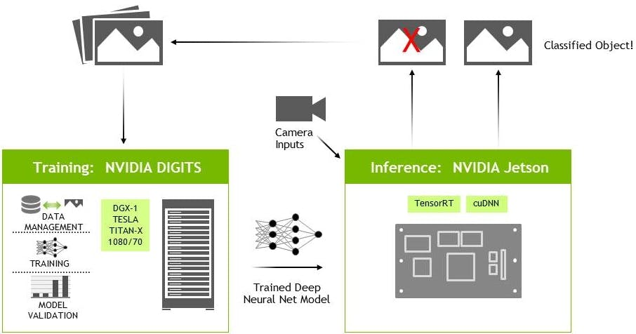

# AIコンテンツ from KIT
---
## 2019 みらいクリエイター養成塾 

###  [講義資料](slides/future_creater_2019.pdf)

## ハンズオンコンテンツ

### part1 (IBM watson利用)

###  [金沢観光チャットボット](https://assistant-chat-jp-tok.watsonplatform.net/web/public/941cb5be-e6f6-4bb8-938a-0c74663956bd)

- ※観光地名として以下と学習しています。
- 金沢城、兼六園、しいのき迎賓館、ひがし茶屋街、近江町市場、金沢能楽美術館、石川県立美術館、石川県立歴史博物館、鈴木大拙館

- テキスト文の入力も可能ですが、学習量が少ないためヒットしずらいかと思います。
  - 入力例：金沢城→金沢城の紹介
  - 美味しい海鮮丼が食べたい→近江町市場の紹介

###  [トイプードルと唐揚げ(学習枚数10枚)の画像認識](https://europa.kanazawa-it.ac.jp/watsonapi/vroc1.jsp)

- ※すでにトイプードルと唐揚げを学習済みです。ファイル選択→この画像は何?で検証できます。

### [トイプードルと唐揚げ(学習枚数100枚)の画像認識](https://europa.kanazawa-it.ac.jp/watsonapi/vroc2.jsp)
- ※すでにトイプードルと唐揚げを学習済みです。ファイル選択→この画像は何?で検証できます。

### [食品の画像認識](https://europa.kanazawa-it.ac.jp/watsonapi/vrfood.jsp )
- ※IBMが提供している食品モデルを使用しています。ファイル選択→識別開始で検証できます。

---
## ハンズオンコンテンツ Part2
- 現在のAIは，推論を行うエッジAIと学習を行うクラウドAIから構成されている．

- 本日の授業では，エッジAIを用いた演習を行います．
  - [ImageNetを用いた画像の分類](classify.md)
  - [ライブカメラでの画像認識](live_camera_classify.md)
  - [画像領域の検出](detect.md)
  - [ライブカメラでの画像領域の検出](live_camera_detection.md)
  - []

